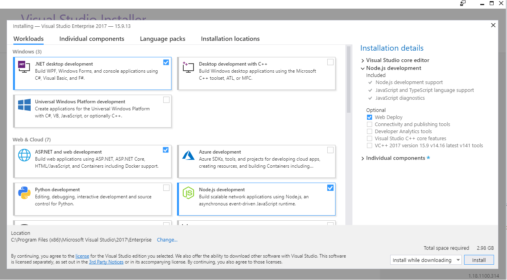
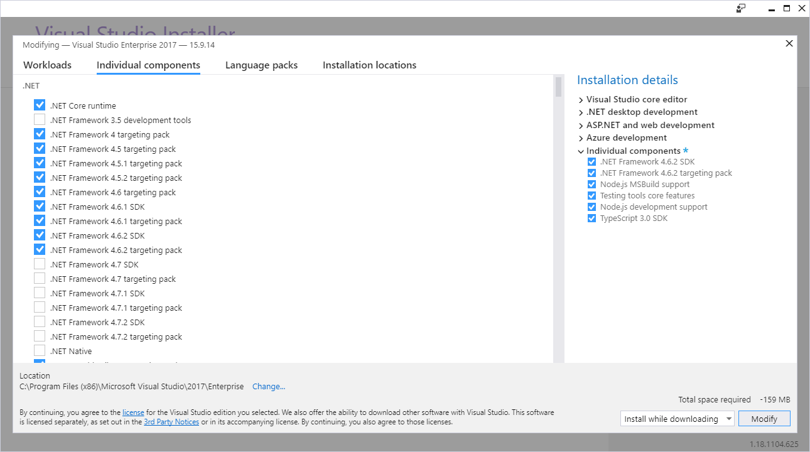

# Install prerequisite Software for Extension Development

Install the following software. Your team should be aware of the most current download locations so that you can complete your own installs.

## Common

1. Windows 10, Windows Server 2012 R2, or the most recent edition of the client or server platform.

    * Windows 10
    
      [https://www.microsoft.com/en-us/software-download/windows10](https://www.microsoft.com/en-us/software-download/windows10)

    * Windows Server 2012 R2

      [https://www.microsoft.com/en-us/download/details.aspx?id=41703](https://www.microsoft.com/en-us/download/details.aspx?id=41703)

1. Install [Node.js LTS 10.6.0 or later](https://nodejs.org/dist/v10.6.0/node-v10.6.0-x64.msi).

1. Install npm version 6.10.0 or later. To install run the following from the command prompt `npm install -g npm@latest`

1. Install [Nuget + Credential Provider](https://msazure.pkgs.visualstudio.com/_apis/public/nuget/client/CredentialProviderBundle.zip) 

      * unzip to some path e.g c:\dev\_prereq then add it to your environmental path by running the following command from an administrative command prompt `setx PATH "%PATH%;c:\dev\_prereq\CredentialProviderBundle"`

1. Install [git](https://git-scm.com/downloads)

## IDE Specific

### Visual Studio Code (or other similar IDE)

1. Install [.NET 4.5.2](https://www.microsoft.com/en-us/download/details.aspx?id=42642)

1. Install [Build Tools 2015](https://www.microsoft.com/en-us/download/details.aspx?id=48159)

      * Add it to your environmental path by running the following command from an administrative command prompt `setx PATH "%PATH%;C:\Program Files (x86)\MSBuild\14.0\Bin\"`

1. Install [Visual Studio Code](https://code.visualstudio.com/download)
    
    If you also have VS 2017 installed or are on CoreXT a large number of the following will already be present and coming from your CxCache %NugetMachineInstallRoot%. You can check each in your development environment and apply on a case by case basis.

### Visual Studio 2017

1. TypeScript 3.2.2 for Visual Studio 2017 that is dated Dec 10, 2018. It is located at [https://www.microsoft.com/en-us/download/details.aspx?id=55258](https://www.microsoft.com/en-us/download/details.aspx?id=55258)

1. Node tools that are located at [https://github.com/Microsoft/nodejstools/releases/tag/v1.3.1](https://github.com/Microsoft/nodejstools/releases/tag/v1.3.1)

1. Visual Studio 2017 Professional or Enterpise version 15.9.13 or later that is located at [https://visualstudio.microsoft.com/downloads/](https://visualstudio.microsoft.com/downloads/).
      
      * select the following components 

      

      

To validate that your dev machine is ready for Azure Portal Extension development start with the template extension in the [Getting Started Guide](top-extensions-getting-started.md)
